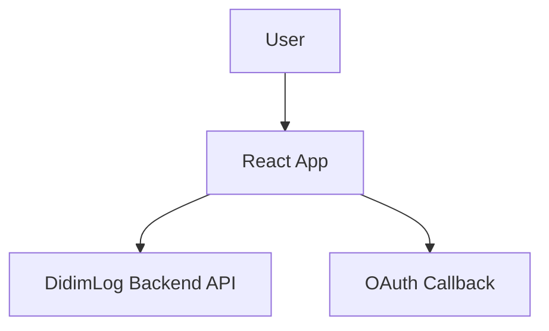

# DidimLog Frontend
> **한 줄 소개**: 알고리즘 학습 데이터를 대시보드와 AI 회고 UI로 연결한 React/TypeScript 기반 웹 클라이언트

## 1. 프로젝트 개요 (Overview)
- **개발 기간**: 2025 ~ 진행 중
- **개발 인원**: 프론트엔드 중심 개발
- **프로젝트 목적**: 학습 데이터, 추천 문제, 회고 작성을 한 화면 흐름에서 연결해 사용자 학습 루프를 강화
- **GitHub**: https://github.com/didim-log/didim-log-FE

## 2. 사용 기술 및 선정 이유 (Tech Stack & Decision)

| Category | Tech Stack | Version | Decision Reason (Why?) |
| --- | --- | --- | --- |
| **Language** | TypeScript | 5.5+ | API 응답/도메인 타입을 강제해 런타임 오류를 사전에 줄이기 위함 |
| **UI Framework** | React | 18.3.1 | 컴포넌트 단위 상태 분리와 재사용으로 기능 확장 속도 확보 |
| **Build** | Vite | 5.4.x | 빠른 개발 서버와 번들 커스터마이징(`manualChunks`)으로 성능 튜닝 용이 |
| **State/Data** | TanStack Query, Zustand | Query v5 / Zustand v4 | 서버 상태 캐싱과 전역 UI 상태를 분리해 복잡도 제어 |
| **Styling** | Tailwind CSS | 3.4+ | 디자인 시스템을 빠르게 반영하고 일관된 스타일 유지 |

## 3. 시스템 아키텍처 (System Architecture)

- **설계 특징**:
- `features` 중심 구조로 페이지/도메인 로직을 분리
- `api/endpoints` + `hooks/api`로 네트워크 호출 계층화
- 라우트 가드(`Public/Private/Admin Route`)로 접근 제어 분리

## 4. 핵심 기능 (Key Features)
- **대시보드 시각화**: 활동 히트맵, 통계 차트, 추천 문제 위젯 제공
- **AI 회고 작성 UX**: Markdown 에디터와 AI 피드백 카드 연동
- **인증 흐름**: OAuth 콜백 처리, 토큰 기반 인증 상태 유지
- **관리자 기능**: 공지/인용구/사용자/AI 품질 관리 UI 제공

## 5. 트러블 슈팅 및 성능 개선 (Troubleshooting & Refactoring)
### 5-1. 초기 로딩 번들 비대화 대응
- **문제(Problem)**: 시각화/에디터/마크다운 라이브러리 동시 로드로 초기 진입 성능 저하 가능성
- **원인(Cause)**: 단일 번들로 묶일 경우 첫 진입 시 파싱/평가 비용 집중
- **해결(Solution)**:
  1. Vite `manualChunks`로 `react-vendor`, `data-vendor`, `markdown-vendor`, `editor-vendor` 분리
  2. 페이지 단위 lazy loading 적용
- **검증(Verification)**: 빌드 산출물 청크 분리 여부 확인 및 주요 화면 라우트 전환 체감 지연 비교
- **결과(Result)**: 초기 로딩과 라우트 전환의 체감 성능 개선, 회귀 시 원인 청크 역추적 가능

### 5-2. 프론트-백 API 계약 불일치 리스크 완화
- **문제(Problem)**: 카테고리/템플릿 규칙 불일치 시 요청 실패 및 UX 혼선 발생
- **원인(Cause)**: 프론트 상수와 백엔드 enum 정책이 분산 관리될 때 변경 누락 발생
- **해결(Solution)**:
  1. API 규칙을 문서(`FRONTEND_UPDATE_GUIDE`)로 고정
  2. 타입/상수/엔드포인트 레이어를 분리해 계약 변경 영향 범위 최소화
- **검증(Verification)**: 계약 변경 시 `api/endpoints`와 `types/constants`만 수정되는지 PR 단위 점검
- **결과(Result)**: 계약 변경 시 수정 지점이 명확해져 협업 안정성 향상, 배포 후 장애 가능성 감소

## 6. 프로젝트 회고 (Retrospective)
- **배운 점**: 대시보드형 서비스는 기능 추가보다 데이터 계약과 상태 분리가 유지보수성에 더 큰 영향
- **아쉬운 점 & 향후 계획**: 주요 화면별 Web Vitals 추적을 자동화해 성능 회귀를 CI에서 조기 감지할 계획
