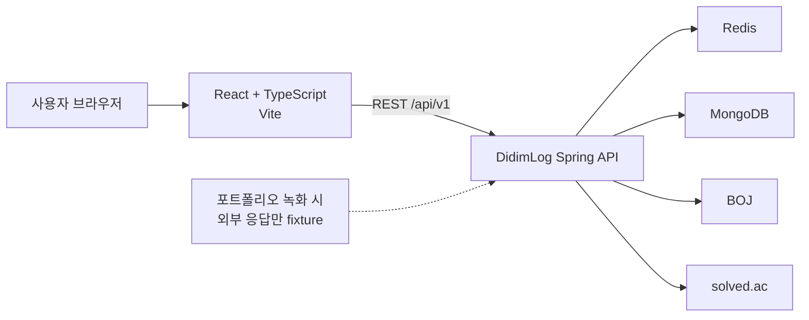
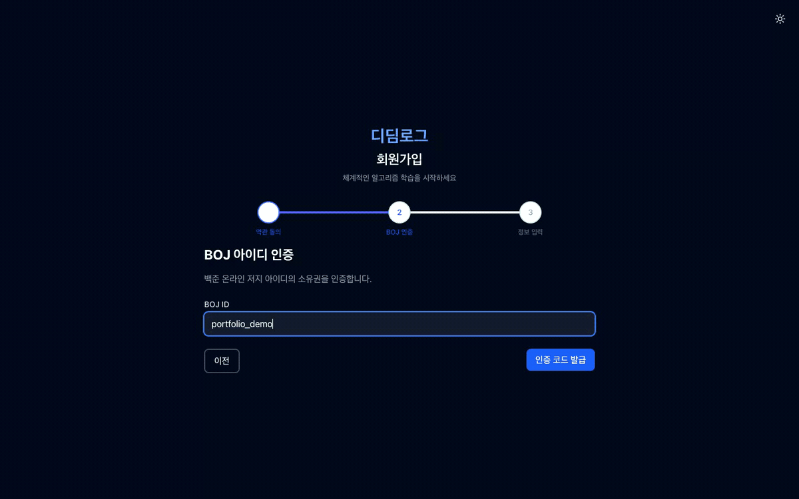

# DidimLog Frontend

> BOJ 문제 탐색부터 풀이 기록, 코드 로그, 회고까지 하나의 학습 흐름으로 연결하는 React/TypeScript 웹 클라이언트

[Frontend Repository](https://github.com/didim-log/didim-log-FE) · [Backend Repository](https://github.com/didim-log/didim-log-BE)

## 소개

DidimLog는 문제를 많이 푸는 것뿐 아니라 **어떻게 풀었고 무엇을 배웠는지 남기는 과정**에 초점을 둔 알고리즘 학습 기록 서비스입니다. BOJ 계정을 인증하고 문제를 탐색한 뒤, 풀이 결과와 코드를 기록하고 Markdown 회고로 이어지는 학습 루프를 제공합니다.

주요 기능은 다음과 같습니다.

- BOJ 프로필 상태 메시지를 이용한 계정 소유권 인증
- 난이도·카테고리 기반 문제 탐색과 추천
- 풀이 시간과 성공/실패 결과 기록
- 풀이 코드를 보존하는 로그와 Markdown 회고 작성
- 활동 히트맵, 통계 차트, 오늘 푼 문제를 제공하는 대시보드
- 관리자용 문제 메타데이터 수집 및 운영 관리 화면

## 기술 스택

| 영역 | 기술 | 선택 이유 |
| --- | --- | --- |
| Language | TypeScript 5.5+ | API 응답과 도메인 모델의 타입을 고정해 런타임 오류를 줄입니다. |
| UI | React 18.3 | 기능 단위 컴포넌트와 페이지를 조합해 학습 흐름을 구성합니다. |
| Build | Vite 5.4 | 빠른 개발 서버와 `manualChunks` 기반 번들 분리를 사용합니다. |
| Server State | TanStack Query v5 | 조회 캐시와 mutation 상태를 API 단위로 관리합니다. |
| Client State | Zustand v4 | 인증·온보딩 등 전역 UI 상태를 서버 상태와 분리합니다. |
| Styling | Tailwind CSS 3.4 | 공통 디자인 규칙을 유틸리티 단위로 일관되게 적용합니다. |
| Editor / Chart | React Markdown, MDEditor, Recharts | 회고 작성과 학습 데이터 시각화를 구성합니다. |

## 아키텍처


```mermaid
flowchart LR
    User["사용자 브라우저"] --> FE["React + TypeScript<br/>Vite"]
    FE -->|"REST /api/v1"| API["DidimLog Spring API"]
    API --> Redis["Redis"]
    API --> Mongo["MongoDB"]
    API --> BOJ["BOJ"]
    API --> SolvedAc["solved.ac"]
    Fixture["포트폴리오 녹화 시<br/>외부 응답만 fixture"] -.-> API
```

포트폴리오 GIF도 브라우저에 띄운 실제 React 앱이 로컬 API를 호출하고, Redis와 MongoDB에 저장하는 흐름을 촬영했습니다. 재현 가능한 녹화를 위해 **외부 BOJ·solved.ac 응답만 fixture로 고정**했으며 FE 화면, API 호출, 인증 상태와 데이터 저장은 연출 화면이 아닌 실제 실행 결과입니다.

프론트엔드는 다음 원칙으로 구성했습니다.

- `features`를 기준으로 페이지와 도메인 로직을 분리합니다.
- `api/endpoints`와 `hooks/api`로 HTTP 호출과 React Query 상태를 계층화합니다.
- `PublicRoute`, `PrivateRoute`, `AdminRoute`로 접근 제어를 분리합니다.
- 페이지 단위 lazy loading과 벤더 청크 분리로 초기 로딩 범위를 줄입니다.

## 핵심 사용자 흐름

### BOJ 인증과 가입

1. 백엔드에서 일회용 BOJ 인증 코드를 발급받습니다.
2. 사용자가 코드를 BOJ 프로필 상태 메시지에 등록합니다.
3. DidimLog가 프로필을 확인해 BOJ ID 소유권을 검증합니다.
4. 인증된 BOJ ID와 계정 정보를 저장하고 가입을 완료합니다.

### 문제 풀이 결과, 코드 로그, 회고 저장

1. 문제 상세에서 풀이를 시작하고 언어와 코드를 입력합니다.
2. 사용자가 성공 또는 실패를 선택하면 `POST /study/submit`으로 문제 ID, 풀이 시간과 결과를 기록합니다.
3. 결과 화면에서 **회고 작성하러 가기**를 누르면 `POST /logs`가 실행되며 이 단계에서 입력한 코드가 로그로 저장됩니다.
4. 저장된 `logId`, 코드, 풀이 시간과 결과를 회고 작성 화면으로 전달합니다.
5. 회고를 저장하면 `POST /retrospectives?problemId=...`로 회고가 생성되고 목록에서 다시 확인할 수 있습니다.

> `POST /study/submit`은 풀이 결과를 기록하는 요청이며 코드를 실행하거나 채점하지 않습니다. 코드 로그 저장 시점은 **회고 작성하러 가기**를 누른 뒤 실행되는 `POST /logs` 단계입니다.

## 화면으로 확인하기

03 GIF의 `Local fixture` 표시는 외부 BOJ·solved.ac 응답을 고정한 녹화 환경임을 뜻합니다. 01도 같은 fixture 경계에서 촬영했으며, 두 영상의 FE, API, Redis와 MongoDB 동작은 실제 로컬 서비스입니다.

| GIF | 기능 요약 |
| --- | --- |
| `01` | BOJ 상태 메시지 인증 → 회원 정보 입력 → 가입 완료 → 대시보드 이동 |
| `03` | 풀이 결과 저장 → 입력 코드 로그 저장 → 코드가 포함된 회고 저장·조회 |

### 1. BOJ 계정 인증과 회원가입

BOJ ID 입력, 인증 코드 발급, 프로필 상태 메시지 검증과 가입 완료까지의 흐름입니다.



### 2. 문제 풀이 결과와 코드·회고 저장

문제 풀이 화면에서 코드를 작성한 뒤 결과를 기록하고, 코드 로그와 회고를 차례로 저장해 목록에서 확인합니다.


## 카테고리 수집과 필터

프론트엔드가 BOJ나 solved.ac를 직접 크롤링하지는 않습니다. 관리 화면에서 메타데이터 수집을 요청하면 백엔드가 문제와 solved.ac 태그를 수집·정규화하고, 프론트엔드는 `GET /problems/categories/meta`로 카테고리 메타데이터를 조회합니다.

문제 목록에서는 정규화된 대표 카테고리와 보조 태그를 보여주며 다음 검색 모드를 API에 전달합니다.

| 모드 | 동작 |
| --- | --- |
| `EXACT` | 선택한 카테고리와 정확히 일치하는 문제를 조회합니다. |
| `HIERARCHY` | 선택한 카테고리와 하위 태그를 포함해 조회합니다. |
| `RELATED` | 계층 결과에 부모·형제 관계를 더해 범위를 확장합니다. |

크롤러, 카테고리 정규화와 저장 로직은 [DidimLog Backend](https://github.com/didim-log/didim-log-BE)에서 확인할 수 있습니다.

## 실행 방법

### 사전 준비

- Node.js와 npm
- 실행 중인 [DidimLog Backend](https://github.com/didim-log/didim-log-BE)

```bash
npm ci
```

루트에 `.env.development`를 생성합니다.

```dotenv
VITE_API_URL=http://localhost:8080
VITE_PORTFOLIO_FIXTURE=false
```

```bash
npm run dev
```

기본 개발 서버 주소는 `http://localhost:5173`입니다.

### 환경 변수

| 변수 | 필수 | 설명 |
| --- | --- | --- |
| `VITE_API_URL` | 예 | 백엔드 origin 또는 `/api/v1`까지 포함한 API URL입니다. origin만 지정하면 앱이 `/api/v1`을 붙입니다. |
| `VITE_PORTFOLIO_FIXTURE` | 아니요 | `true`일 때 녹화 화면에 `Local fixture` 배지를 표시합니다. 외부 fixture 자체를 활성화하는 설정은 아닙니다. |

## 테스트와 검증

```bash
# 단위 테스트
VITE_API_URL=http://localhost:8080/api/v1 npx vitest run

# 타입 검사와 프로덕션 빌드
npm run build

# 회고 템플릿 렌더링 검증
npm run verify:template-render
```

## 사실적 한계

- DidimLog는 온라인 저지나 코드 실행 환경이 아닙니다. 작성한 코드를 BOJ에 제출하거나 정답 여부를 자동 판정하지 않습니다.
- 성공/실패는 사용자가 직접 선택하며 서비스는 그 선택과 풀이 시간을 학습 기록으로 저장합니다.
- 풀이 화면에서 입력한 코드는 결과 선택 시점이 아니라 **회고 작성하러 가기 → `POST /logs`** 단계에서 로그로 저장됩니다.
- 포트폴리오 GIF에서는 외부 서비스 상태와 네트워크 편차를 제거하기 위해 BOJ·solved.ac 응답만 fixture로 사용합니다.
- BOJ와 solved.ac의 데이터 및 상표는 각 서비스에 귀속되며 DidimLog는 두 서비스의 공식 제품이 아닙니다.

## 트러블슈팅과 개선

### 초기 로딩 번들 비대화

- **문제**: 차트, 에디터와 Markdown 라이브러리가 동시에 로드되면 첫 진입 비용이 커질 수 있었습니다.
- **해결**: Vite `manualChunks`로 `react-vendor`, `data-vendor`, `markdown-vendor`, `editor-vendor`를 분리하고 페이지 단위 lazy loading을 적용했습니다.
- **결과**: 초기 로딩과 라우트 전환의 책임 청크가 구분되어 성능 회귀를 추적하기 쉬워졌습니다.

### 프론트엔드와 백엔드의 카테고리 계약

- **문제**: 프론트엔드 표시값과 백엔드 카테고리 enum이 다르면 필터 결과가 누락될 수 있었습니다.
- **해결**: UI 별칭을 API 값으로 매핑하고, 백엔드의 카테고리 메타데이터를 조회해 표시명과 계층 관계를 구성했습니다.
- **결과**: API 계약 변경의 영향 범위를 endpoint, type과 category mapping 계층으로 제한했습니다.

## 회고

- 대시보드형 서비스에서는 기능 수보다 데이터 계약과 서버/클라이언트 상태의 경계를 명확히 하는 일이 유지보수성에 더 큰 영향을 주었습니다.
- 주요 화면의 Web Vitals와 핵심 사용자 흐름을 자동 검증해 성능·기능 회귀를 CI에서 더 일찍 발견하는 것이 다음 개선 과제입니다.
